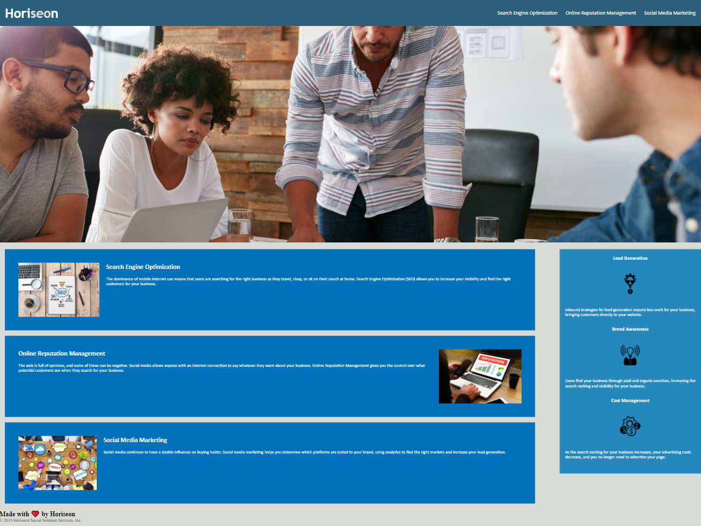

# Horiseon SEO Project

## This Repository
This repository is where I made changes to the Horiseon company website to meet a certain set of standards by: updating semantic elements and arranging the website so it is more accesible for people with disabilities or socio-economic restrictions.

## The Horiseon Website

## Project Updates

* Programming languages used: HTML and CSS
* Semantic elemetnts replaced Div elements
* Consolidate div elements
* Hero and Navigation elements updated to work properly
* ID added to fix "Search Engine Optimization" navigation element
* Classes re-structered so CSS elements can be simplified
* CSS Elements consolidated

##  See Our Updates Here
To see Our Updated Horiseon Website Click Here! [Horiseon Website!](https://BradenWelsh.github.io/weekly-challenge-01/)
